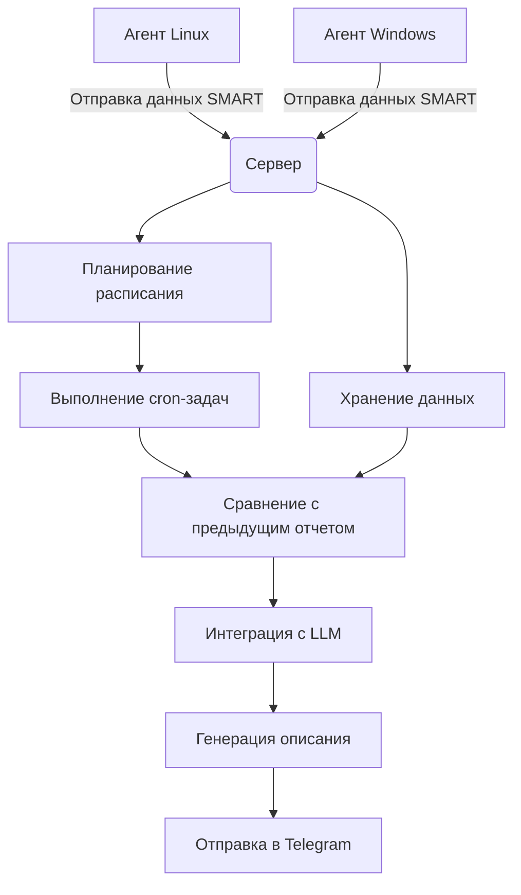

# Smart-Control

Smart-Control — это комплексное решение для мониторинга состояния дисковых устройств и отправки отчетов через Telegram-бот. Оно включает в себя серверное приложение, которое обрабатывает данные от агентов, и агентские приложения для Linux и Windows, которые собирают информацию о дисках на домашних компьютерах, ноутбуках, домашних серверах, и отправляют её на домашний сервер пользователя. Сервер использует LLM для описания состояния дисков и выдачи рекомендаций, и сообщает их пользователю через бота Telegram.

[](https://covrom.github.io/smart-control/smart-control.mp4)

Главная цель Smart-Control — это создание централизованной, интеллектуальной и удобной системы для проактивного мониторинга здоровья жестких дисков (HDD) и твердотельных накопителей (SSD) на множестве компьютеров (серверов и рабочих станций) с последующей отправкой понятных и полезных отчетов обычному пользователю через популярный мессенджер Telegram.

Если говорить проще, система призвана ответить на вопросы:
* "В каком состоянии мои диски?"
* "Какому диску грозит скорый выход из строя?"
* "Что означают эти сложные технические параметры SMART?"

Система не просто выгружает сырые технические данные (которые сложно интерпретировать неподготовленному пользователю), а превращает их в понятный текст на естественном языке.

Пользователь получает не просто список чисел ("Raw_Read_Error_Rate = 0"), а готовый вывод: "✅ Всё в порядке — никаких признаков деградации" или "⚠️ Внимание! Растет количество переназначенных секторов, рекомендуется проверить диск и подготовить замену". Это экономит время и делает отчеты доступными для понимания.

Приложение работает как на Linux (через Docker-контейнер), так и на Windows (в виде службы). Это позволяет контролировать состояние дисков на всем парке разнородного оборудования (например, домашний NAS на Linux, рабочий ПК на Windows и сервер в дата-центре) из единого центра.

От пользователя не требуется постоянно вручную запускать проверки. Агенты сами собирают данные, отправляют на сервер, который их анализирует и присылает отчет. Мониторинг становится проактивным — система сама "стучится" к пользователю с информацией, а не ждет, пока пользователь о ней вспомнит.
Сервер не только обрабатывает разовые запросы, но и хранит данные, сравнивая текущий отчет с предыдущим. Это позволяет отслеживать ухудшение состояния диска в динамике. Например, увидеть, что "количество переназначенных секторов за последний месяц выросло на 10" — гораздо более важный сигнал, чем просто его текущее значение.

Smart-Control — это не просто "еще один парсер SMART-данных". Это единый, умный и автоматизированный помошник, который превращает сложную техническую диагностику дисков в простые и своевременные уведомления в любимом мессенджере.

## Описание компонентов

### Серверное приложение
Серверное приложение отвечает за:
- Прием данных от агентов
- Обработку и хранение информации о состоянии дисков
- Взаимодействие с Telegram-ботом для отправки уведомлений
- Управление задачами и cron-расписаниями
- Интеграцию с LLM для анализа данных SMART:
  - любые публичные OpenAI API (например, openrouter)
  - локальные модели Ollama (https://docs.ollama.com/api/openai-compatibility)
  - локальные модели Llama.cpp

### Агентское приложение для Linux (docker контейнер)
Агентское приложение для Linux собирает информацию о дисках и отправляет её на сервер:
- Сбор данных SMART с дисков (с помощью smartctl)
- Отправка данных через Telegram-бота
- Работа в фоновом режиме
- Автоматическое обновление информации
- Поддержка различных дисковых устройств

### Агентское приложение для Windows
Агентское приложение для Windows также собирает информацию о дисках и отправляет её на сервер:
- Сбор данных SMART с дисков (с помощью smartctl для windows)
- Отправка данных через Telegram-бота
- Работа как Windows-служба
- Автоматическое обновление информации
- Поддержка различных дисковых устройств

## Установка

### Установка сервера
Для установки сервера выполните скрипт:
```bash
./deploy-server-example.sh
```

### Установка агента для Linux
Для установки агента для Linux выполните скрипт:
```bash
./deploy-agent-example.sh
```

### Установка агента для Windows
Для сборки дистрибутива агента для Windows выполните скрипт:
```bash
./build-winsvc.sh
```

## Переменные окружения

Перед установкой необходимо изменить следующие переменные окружения в соответствующих файлах:

- `deploy-server-example.sh` — переменные для сервера
- `deploy-agent-example.sh` — переменные для агента Linux

### Переменные окружения для сервера

- `OPENAI_BASE_URL` — URL-адрес API OpenAI (например, `http://192.168.1.1:8080/v1`)
- `OPENAI_API_KEY` — API-ключ OpenAI
- `OPENAI_MODEL` — используемая модель OpenAI (например, `qwen3-30b-a3b-instruct-2507`)
- `TELEGRAM_BOT_TOKEN` — токен Telegram-бота
- `TELEGRAM_CHAT_ID` — ID чата Telegram (число)

### Переменные окружения для **агента** в docker контейнере

- `HTTP_AUTH_TOKEN` — токен аутентификации между агентами и сервером
- `SMART_HOSTNAME` — имя агента
- `COLLECTOR_URL` — URL-адрес для отправки данных от агента на сервер (например, `http://smart-control:8000/smart/report`)
- `CRON_SCHEDULE` — расписание cron для запуска задач (например, `"55 23 * * *"`)

### Настройка агента Windows

Производится во время установки дистрибутива, на соответствующей странице установщика.

## Структура проекта

- `cmd/tgsmctl/` — точка входа для серверного приложения
- `internal/api/` — HTTP API сервера
- `internal/cron/` — реализация cron-задач
- `internal/disk/` — сбор данных SMART
- `internal/llmdesc/` — интеграция с LLM для описания состояния дисков
- `internal/smartdata/` — обработка данных SMART
- `win/` — агент для Windows
- `docker-compose.yml` — docker-compose для запуска сервера
- `docker-compose.agent.yml` — docker-compose для запуска агента Linux
- `deploy-server-example.sh` — скрипт разворачивания сервера
- `deploy-agent-example.sh` — скрипт разворачивания агента Linux
- `build-winsvc.sh` — скрипт сборки Windows-агента

## Требования

- Docker
- Docker Compose
- Telegram-бот для отправки уведомлений
- OpenAI API ключ для анализа данных SMART

## Пример использования

1. Создайте Telegram-бота и получите токен
2. Настройте переменные окружения в `deploy-server-example.sh` и `deploy-agent-example.sh`
3. Запустите сервер: `./deploy-server-example.sh`
4. Запустите агент: `./deploy-agent-example.sh` или соберите Windows-агент с помощью `./build-winsvc.sh`
5. Наблюдайте за уведомлениями в Telegram-чате:

```
💻 Анализ для server-1 (linux)
📀 Устройство: /dev/nvme0, точки монтирования:
/mnt/database-disk
/var/lib/docker/volumes/registry-data/_data

ADATA LEGEND 900, NVMe, M.2 2280, TLC, TBW: 1,500, MTBF: 1,500,000 ч, Speed: до 7,450 МБ/с, Capacity: 2.04 ТБ, Power-on hours: 391, Total written: 2.39 ТБ.

✅ Всё в порядке — никаких признаков деградации или неисправности. Показатели остаются стабильными, ошибки отсутствуют, запасные секторы и процент износа не изменились.
```

## Схема работы



## Лицензия

Этот проект распространяется по лицензии MIT. Подробности смотрите в файле [LICENSE](LICENSE).
